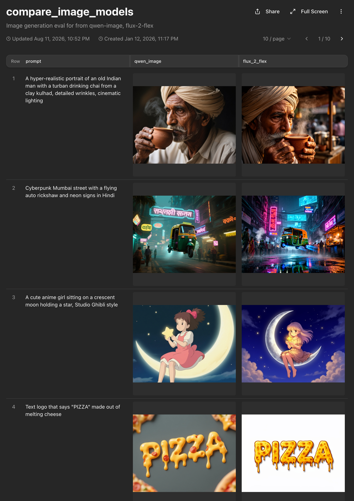

# Compare Image Models <a href="https://app.mixtrain.ai/new?from=https%3A%2F%2Fgithub.com%2FMixTrain%2Fmixtrain-examples%2Ftree%2Fmain%2Fcompare-image-models&amp;type=workflow"></a>

Create your own text to image eval in minutes: give it a CSV of prompts, pick the models (public or private models) and get back [sharable eval](https://app.mixtrain.ai/s/KUCY6k1cBgZV-IjPbglvsRexw-6LtvQHtmP2fsLp55s) with prompt and images from each model, like below.

[](https://app.mixtrain.ai/s/KUCY6k1cBgZV-IjPbglvsRexw-6LtvQHtmP2fsLp55s)

## Run it

1. [Import](https://app.mixtrain.ai/new?from=https%3A%2F%2Fgithub.com%2FMixTrain%2Fmixtrain-examples%2Ftree%2Fmain%2Fcompare-image-models&amp;type=workflow) the workflow or create from the CLI:

    ```bash
    mixtrain workflow create . --name compare-image-models
    ```

    This will create a new [compare-image-models workflow](workflows/compare-image-models) 

2. Run workflow. 

    Open [image-gen-eval](https://app.mixtrain.ai/evaluations/image-gen-eval) to compare the results visually.

By default it uses prompt set in [prompts.csv](prompts.csv) and compares `Flux 2` and `Qwen Image` models. You can also upload your
own prompt file and pick whichever models you want to compare in the run dialog. You can compare your own models and public from the models selector dropdown in run dialog.

As you add more prompts to eval over time, it will automatically keep a versioned results dataset. This can be used to [inspect, query, explore](https://mixtrain.ai/docs/reference/python/dataset#sql) and further analyse questions like:
1. What kinds of category my image eval data covers?
2. What is color distribution of images?
3. How many images are outdoors vs indoors?
4. What kinds of prompts work best for which models

.. and so on.

## Learn more

- [Workflows guide](https://mixtrain.ai/docs/guide/workflows)
- [Evaluations guide](https://mixtrain.ai/docs/guide/evaluations)