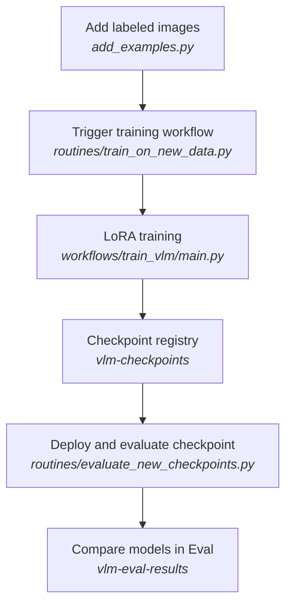
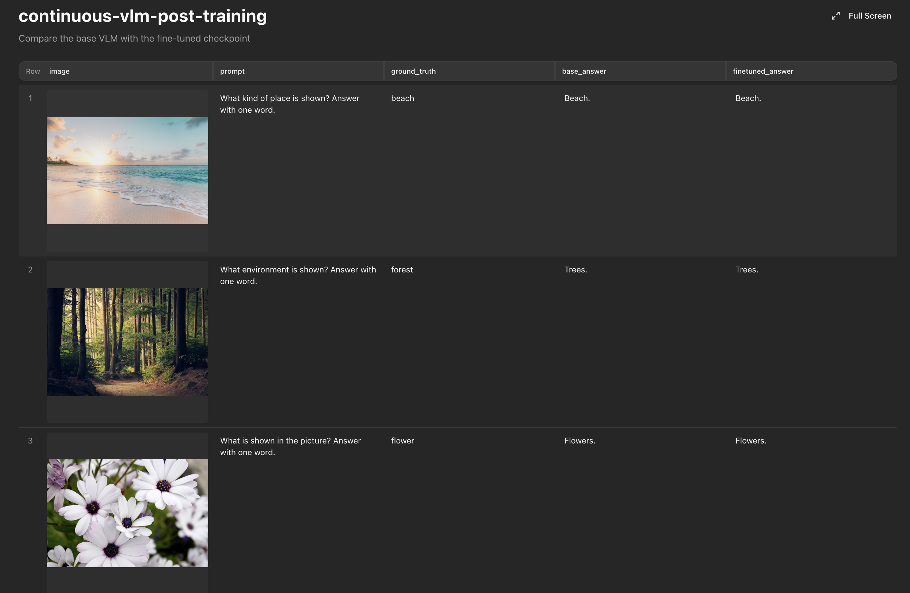

# Continuous VLM Post-Training

This example continuously fine-tunes a vision-language model as new labeled data is added and
then evaluates the new model against the base model on held-out images. With the help of the evaluation, you can append new labeled data to the dataset and continuously improve the model.



## Result 
[Here](https://app.mixtrain.ai/s/dXOWwcZFsOIEruItpCG-1wOqAKO3TDFIAJDZBB05Q4Q) is how the overall evaluation results look like after the first training run.




## Run it

You need the [Mixtrain CLI](https://mixtrain.ai/docs/guide/quickstart). The example uses
`HuggingFaceTB/SmolVLM-256M-Instruct` but you can use any other VLM.

Run the following from this directory.

### 1. Create the datasets and Eval

```bash
python setup_resources.py
```

This creates the source-data, checkpoint, and result datasets, plus an empty
Eval. The output includes links to the created resources.

### 2. Create the training workflow

```bash
mixtrain workflow create workflows/train_vlm --name train-vlm
```

This creates the SFT LoRA training workflow using Hugging Face's TRL library. The workflow takes a training dataset and a base model and trains a LoRA adapter on it. Note that the workflow auto installs the dependencies from `requirements.txt` file. Mixtrain automatically handles dependecies from pyproject.toml, requirements.txt or Dockerfile, without the need for seperate build pipelines.

### 3. Create the Dataset-triggered Routine

```bash
mixtrain routine create routines/train_on_new_data.py --name train-on-new-vlm-data
```

This Routine watches for new `train` rows in `vlm-post-training-data` dataset and submits `train-vlm` workflow run when new data is available. Routines are declarative, and auto trigger based on the dataset changes or scheduled events, without needing additional infrastructure like Airflow or cron jobs.

### 4. Create the evaluation Routine

```bash
mixtrain routine create routines/evaluate_new_checkpoints.py --name evaluate-new-vlm-checkpoints
```

This Routine watches for new checkpoints in `vlm-checkpoints` registry. As new checkpoints are created, it deploys them as a new Model using vLLM and runs evaluation against the base model for the eval dataset. Note that routines can contain any complex logic, across multiple files, support the same dependency management as workflows and can be run on GPUs. Routines and workflows can also be triggered manually from the Mixtrain UI or CLI.

### 5. Add the training data

```bash
python add_examples.py data/initial_examples.csv
```

The script adds examples from a CSV file and appends them to the `vlm-post-training-data` dataset. `Dataset.append(copy_files=True)` also takes care of resolving local image references in the CSV file and uploading them to the Mixtrain workspace.

This automatically starts the continuous training loop above. And in around 2-3 minutes, you should see the training and evaluations completed with the eval results that looks like [this](https://app.mixtrain.ai/s/dXOWwcZFsOIEruItpCG-1wOqAKO3TDFIAJDZBB05Q4Q).


### Optional: add a second batch

```bash
python add_examples.py data/new_training_examples.csv
```

This appends two new training examples, so you can see the continuous training
loop run again.

## The datasets

The `vlm-post-training-data` dataset has the following structure:

| Column | Description |
| --- | --- |
| `sample_id` | Example identifier |
| `split` | `train` or `eval` |
| `image` | Mixtrain `Image` |
| `prompt` | Question sent to the model |
| `ground_truth` | Expected answer |

The `vlm-checkpoints` registry contains the LoRA `Checkpoint`s produced by each training run.
The `vlm-eval-results` Eval dataset contains held-out examples with `base_answer` and
`finetuned_answer` from the base and finetuned models.

## Adapt it to your own data and model

The Mixtrain-facing training integration is in `workflows/train_vlm/main.py`. The main training code is in `workflows/train_vlm/training.py`. To use a different training configuration (different model, different GPUs etc.), you can run manually by passing different arguments to the workflow or change the defaults in `main.py`. 

Refer to Mixtrain [Workflows](https://mixtrain.ai/docs/guide/workflows) guide for more information on how to create and manage workflows.

## Clean up

```bash
mixtrain routine delete train-on-new-vlm-data
mixtrain routine delete evaluate-new-vlm-checkpoints
mixtrain workflow delete train-vlm
mixtrain dataset delete vlm-post-training-data
mixtrain dataset delete vlm-checkpoints
mixtrain dataset delete vlm-eval-results
```

## Learn more

- [Datasets and versions](https://mixtrain.ai/docs/guide/datasets)
- [Routines](https://mixtrain.ai/docs/guide/routines)
- [Evaluations](https://mixtrain.ai/docs/guide/evaluations)
- [TRL vision-language SFT](https://huggingface.co/docs/trl/main/sft_trainer)
